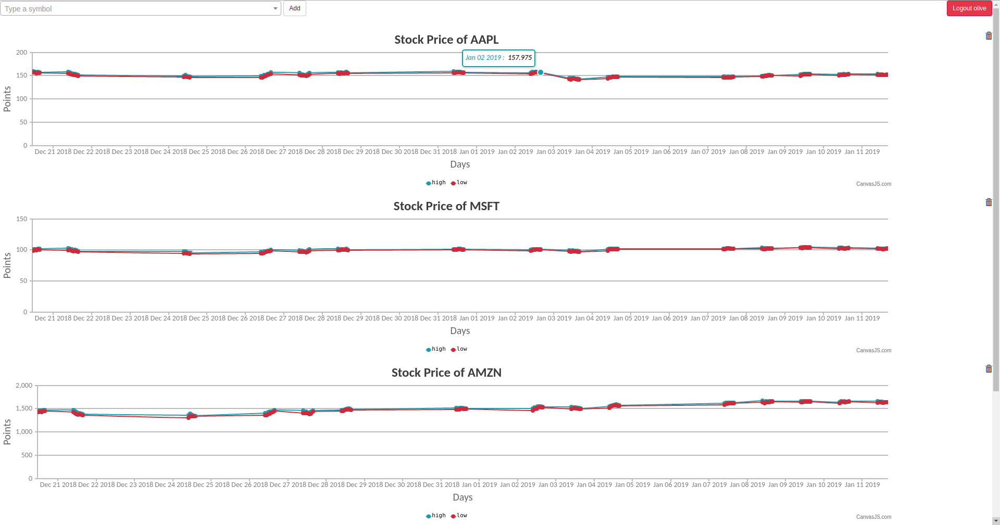

# stock-talk

This repository contains the code a Flask application that allows a user to add stock symbols and track them in the dashboard.

### Endpoints
+ `GET /register`: Renders the register page
+ `GET /login`: Renders the login page
+ `GET /search`: Takes `sym` parameter and fetches stock symbols
+ `GET /timeseries`: Takes `sym` parameter and fetches timeseries stock values
+ `GET /dashboard`: Renders the dashboard page 
<br/>
+ `POST /register`: Creates a user in the database
+ `POST /login`: Creates a user session with existing user
+ `POST /logout`: Logs out a user session
+ `POST /save`: Takes a `sym` data parameter and saves it against a user
+ `POST /remove`: Takes a `sym` data parameter and deletes it from the database

### Requirements
All the code is written in Python 3. The primary database is MongoDB. The dependencies can be installed by:

```
$ pip install -r requirements.txt
```
The stock market data is supplied by [Alpha Vantage API](https://www.alphavantage.co/). Before starting, get your API key and add it to the file `stocktalk/config/dev.py`.

### Run the app
Activate the virtual environment.
```
$ source activate <venv>
```
The necessary development environment variables can be set by:
```
$ source dev.env
```
Once the environment is activated, run the app using:
```
$ flask run
```
<br/>
A screenshot of the dashboard:


